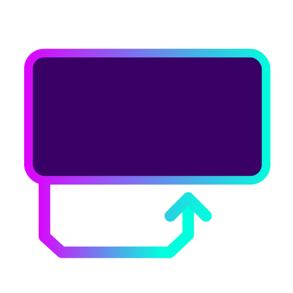

 <p align="center">
    
 </p>
 <h1  align="center">Juli Programming Language</h1>
My own programming language called Juli in Typescript and React
 
### INFO: Work in progress, some things might not work
#


## Syntax:

Comments:
```py
#This is a comment
```

Create a variable:
```py
var myvariable1 = 100;
var myvariable2 = 100.55;
var myvariable3 = "Hello World";
var myarray = new [500, 1000, 2000, 4000];
```
For loops:
```py
for(var item in myarray) { }
for(var i in range(0, 100)) { }
for(var i in "Hello World") { }
for(var i in new [100, 500, 1000, 5000]) { }
```

Output:
```py
print(50 + 200);
print("Hello World");
print(myvariable1);
print(myarray);
```

Math operations:
```py
100 + 100;
100 - 100;
100 * 100;
100 / 100;
100 % 100;
```

Functions:
```py
func calculateAdd(val1: number, val2: number) : number
{
  return val1 + val2;
}
```

If:
```py
if(myvariable1 == 100)
{
}
```

Access array:
```py
print(myarray[:3]);
print(myarray[1:2]);
print(myarray[2:-1]);
print(myarray[1]);
print(myarray[:]);
```

Repeat string:
```py
print("-" * 50);
```

